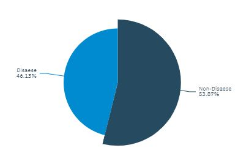
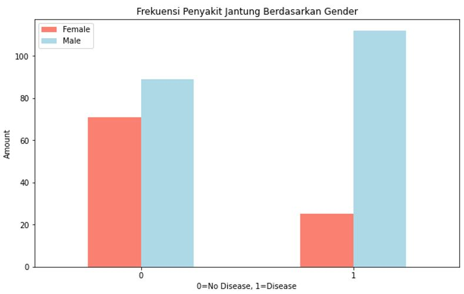
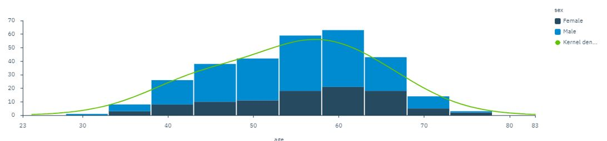
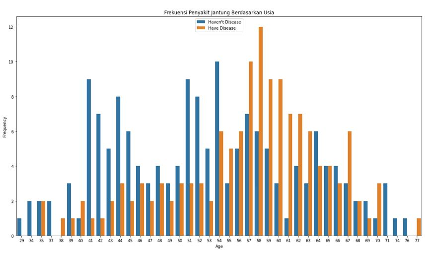
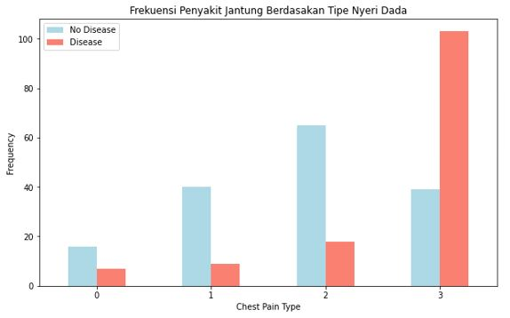
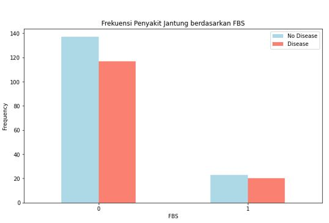
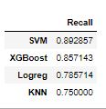
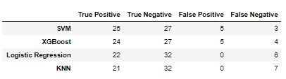

# Heart Disease Classification

## Background and Problems
Heart disease or often referred to as cardiovascular disease is a term to describe various conditions or disorders of the heart, be it coronary artery disorders, heart rhythm problems (arrhythmias), heart defects from birth or chest pain (angina). Heart disease is one of the biggest causes of morbidity and mortality in the world. Data from WHO (World Health Organization) shows that this disease is the leading cause of global death where as many as 17.9 million people die each year. Thus, efforts to prevent heart disease are needed. A good database system can be used to predict heart disease. These predictions can be used to improve the research and prevention process so that it can help ensure more people can live healthy lives and avoid the risk of developing heart disease.

## Object
The classification of risk for heart disease is determined based on several variables from medical data.

## Goals
Classify risk for heart disease for better prevention

## About Data
- Age
- Sex
  - 1 = Male
  - 0 = Female
- Cp : Chest pain type 
  - 0 : tipe angina
  - 1 : antypical angina
  - 2 : non-anginal pain
  - 3 : asymptomatic
- trestbps : Blood pressure at rest (mm Hg)	
- chol : Cholesterol (mg/dl)	
- fbs	: blood sugar content after fasting for 8 hours> 120 mg / dl
  - 0 = False
  - 1 = True)
- restecg : ECG cardiac examination results	
  - 0 : normal
  - 1 : Abnormalitas gelombang ST-T (T wave inversions and/or ST elevation or depression of>0.05 mV)
  - 2 : Kemungkinan terjadi Hipertrofi vertikal kiri
- thalach : Measure the maximum heart rate per minute
- exang :	Symptoms of angina on exertion
  - 1 = Yes
  - 0 : Tidak
- oldpeak : ST segment size on the ECG results from activity to rest
- slope : Slope code for ST segment	
  - 0 : upsloping
  - 1 : flat
  - 2 : downsloping
- ca : The number of major blood vessels 0-3
- thal : Thallium test results
  - 0: normal
  - 1 : fixed defect
  - 2 : reversable defect
- condition : Patient Condition Code	
  - 1 : heart disease
  - 0 : not heart disease

## Exploratory Data Analysis

Based on this figure, from the data obtained, it is known that 46.13% of patients have heart disease, while the rest are known to have no heart disease.

Male is more risky than female

Most of the patients are aged 60 years. Very few patients aged between 30 and 75 years and over were recorded

Risk of heart disease increases with as well as increasing age. Ages 40 and over have an increased risk with a peak between 50 and early 60 years.

Majority of patients who developed heart disease did not present with symptoms such as chest pain

Fasting Blood Sugar is used to measure the concentration of glucose in the blood. When fasting, the level of glucose in the blood will be relatively constant because the body starts to use glycogen as energy. The American Diabetes Association states that patients who have normal blood sugar levels between 70-99 mg / dL and then patients who have blood sugar levels above 120 mg / dL are categorized as obese. From the picture above, it is known that there are many patients who have blood sugar levels below 120 mg / dL. There is no significant difference in blood sugar levels between patients with heart disease and those who are not affected, so this feature is not suitable for further modeling.

## Modelling

Fatal error if:
- Actually, the patient has heart disease, but the model predicts not having heart disease. This can cause a danger to patient's life
- The focus will be on as few False Negatives as possible

SVM is the best model to predict heart disease based on this data

